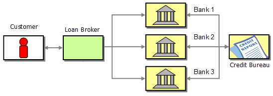
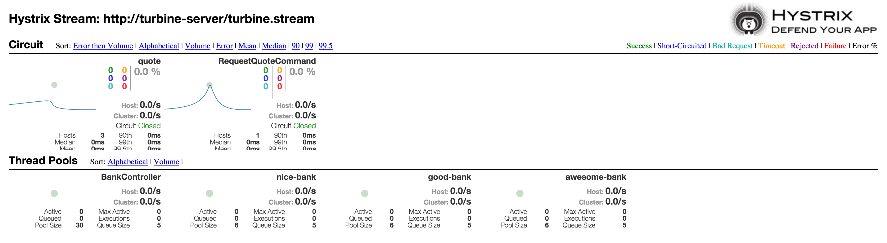

Kubeflix Examples: Loan Broker
------------------------------

Loan Broker example using microservices in Kubernetes. 

The Loan Broker is a very common example of demonstrating how you "compose" services.
    
Taken from the [Enterprise Integration Pattern](http://www.enterpriseintegrationpatterns.com/patterns/messaging/ComposedMessagingExample.html) examples:    
    
    When shopping for a loan, a customer usually calls several banks to find the deal with the best possible interest rate. 
    Each bank asks the customer for his or her social security number, the amount of the loan and the desired term , i.e. 
    the number of months until the loan has to be paid off. Each bank then investigates the customer's credit background, 
    usually by contacting a credit agency. Based on the requested terms and the customer's credit history, the bank responds 
    with an interest rate quote to the consumer (or declines thankfully). Once the customer has received quotes from all banks, 
    he or she can then select the best offer, i.e. the lowest interest rate.
        
This example demonstrates the use case above using Kubernetes, Spring Boot, Hystrix and Ribbon.
    
### The Credit Bureau

The credit buraeu is responsible for evaluating the creditworthiness of the client.
It provides a rest endpoint which accepts the client's SSN as a parameter and return a score (0-1000).

To build to the project:

    cd examples/loanbroker/credit-buraeu
    mvn clean package docker:build fabric8:apply   
        
You can access the servlet at: http://loanbroker-credit-bureau.vagrant.f8/hello (or wherever the loanbroker-credit-buraeu service is bound).
        
        
### The Banks

Each bank communicates with the credit bureau and receives the creditworthiness score of the client.
It uses an algorithm that accepts as input the base rate of the bank, the score and the duration of the loan and calculates the interest.

The bank communicate with the credit bureau via ribbon.

To create a bank

    cd examples/loanbroker/bank
    mvn clean package docker:build fabric8:apply -Dbank.id=<bank's id> -Dbank.name=<bank's name> -Dbank.rate=<base rate>

You can create as many banks as you like by repeating the last command with different arguments. For example:

    mvn clean package docker:build fabric8:apply -Dbank.id=bank1 -Dbank.name="Bank One" -Dbank.rate=15
    mvn clean package docker:build fabric8:apply -Dbank.id=bank2 -Dbank.name="Bank Two" -Dbank.rate=20
    mvn clean package docker:build fabric8:apply -Dbank.id=bank3 -Dbank.name="Bank Three" -Dbank.rate=25

### The Broker

The broker as the name implies accepts a loan request from the client and broadcasts the request to all "known" banks.
Then it collects the results and presents them to the user.

Discovery is done via Kubernetes services (it discovers all services with the label {project: loanbroker-bank}.

Internally the broker is using Spring's Rest Template to communicate with the Banks and each request is wrapped inside Hystrix command.

To build and create the broker:

    cd examples/loanbroker/broker
    mvn clean package docker:build fabric8:apply   

Once the broker has been created you can send http requests to to the broker url, for example:
    
    curl http://loanbroker-broker.vagrant.f8/quote?ssn=12345678&duration=12&amount=10000

### The Generator

To generate the requests automatically a small generator app has been added to the loanbroker example. Its a simple camel/springboot application that generates random loan requests to the rboker.

To build and create the generator:

    cd examples/loanbroker/broker
    mvn clean package docker:build fabric8:apply
    
### Using the Turbine Server and Hystrix Dashboard

It's not a mandatory step but it does help a lot if you bring up the **Turbine Server** and **Hystrix Dashboard** and have a glimpse at the dashboard.
    
    