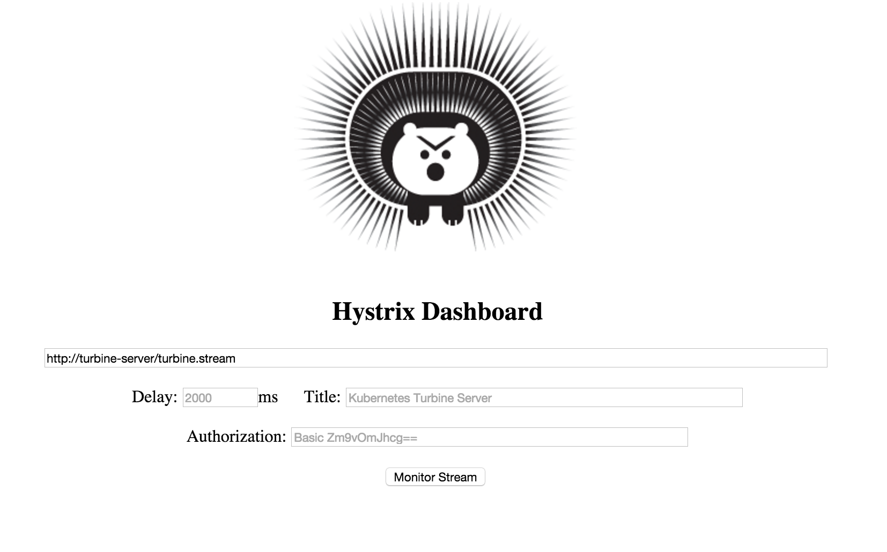

Kubeflix: Kubernetes integration of Netflix components
------------------------------------------------------

This project provides [Kubernetes](http://kubernetes.io/) integration with [Netlix](https://netflix.github.io/) open source components such as [Hystrix](https://github.com/Netflix/Hystrix), [Turbine](https://github.com/Netflix/Turbine) and [Ribbon](https://github.com/Netflix/Ribbon).

  

Specifically it provides:

* Kubernetes Instance Discovery for Turbine and Ribbon
* Kubernetes configuration and images for Turbine Server and Hystrix Dashboard
* Examples

### Turbine Discovery

Turbine is meant to discover and aggregate Hystrix metrics streams, so that its possible to extract and display meaningful information (e.g. display the aggregate stream on the dashboard).

#### How does Turbine work inside Kubernetes?
-----------------------------------

For use inside Kubernetes the project provides a special discovery module called turbine-discovery:

    <dependency>
        <groupd>io.fabric8.kubeflix</groupId>
        <artifactId>turbine-discovery</artifactId>
        <version>x.y.z</version>
    </dependency>    

This discovery module is looking for Kubernetes Pods that contain the following labels:

- hystrix.enabled:   Flag to indicate that the pod is exposing a hystrix stream
- hystrix.cluster:   Optional label to define the name of the Hystrix cluster

## Turbine Server

This project also provides a server that runs turbine with the Kubernetes discovery module preinstalled/preconfigured.

To build the server docker image and apply it to your kubernetes cluster:

    cd turbine-server
    mvn clean package docker:build fabric8:apply   

The **Turbine Server** can be accessed at: http://turbine-server.vagrant.f8/turbine.stream (or wherever the turbine-server service is bound).

### Ribbon Discovery

Ribbon is an IPC framework that among other provides load balancing features over multiple protocols.
This project provides a ribbon discovery module that can be used with ribbon in order to discover and loabalance over Kubernetes endpoints.

#### How does Ribbon work inside Kubernetes?
-----------------------------------

For use inside Kubernetes the project provides a special discovery module called ribbon-discovery:

    <dependency>
        <groupd>io.fabric8.kubeflix</groupId>
        <artifactId>ribbon-discovery</artifactId>
        <version>x.y.z</version>
    </dependency>   

Now, all you need to do is to tell Ribbon that you need to use the [KubernetesServerList](ribbon-discovery/src/main/java/io/fabric8/kubeflix/ribbon/KubernetesServerList.java) for server discovery.

In java code:

    IClientConfig config = IClientConfig.Builder.newBuilder()
                                    .withDefaultValues()
                                    .build()                                   
                                    .set(IClientConfigKey.Keys.NIWSServerListClassName, KubernetesServerList.class.getName())

The [KubernetesServerList](ribbon-discovery/src/main/java/io/fabric8/kubeflix/ribbon/KubernetesServerList.java) will use the created configuration in order to discover service endpoints.

The endpoint name used is always the same as the name of the client.
The namespace and the service port of interest need to be specified in the **IClientConfig** using the following keys:

- KubernetesNamespace
- PortName

for more information look at: [KubernetesConfigKey](ribbon-discovery/src/main/java/io/fabric8/kubeflix/ribbon/KubernetesConfigKey.java).

## Hystrix Dashboard

The Hystrix Dashboard is a web application which allows you to visualize one or more Hystrix streams.
For use inside Docker/Kubernetes this project provides a wrapper module called hystrix-dashboard.

This version of the dashboard comes pre-configured with the **Turbine Server** stream.

To build:

    cd hystrix-dashboard
    mvn clean package docker:build fabric8:apply   

The dashboard can be accessed at:  http://hystrix-dashboard.vagrant.f8:8080 (or wherever the hystrix-dashboard service is bound).

## Examples:

* [Hello World](examples/hello-world/readme.md)
* [Loan Broker](examples/loanbroker/readme.md)
